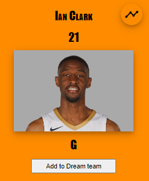
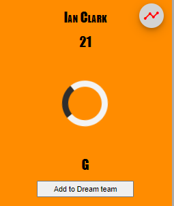
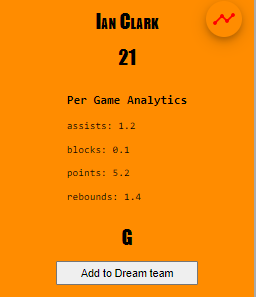

# myNBA

## Introduction

A full stack project to display NBA players cards, based on their team name and year. In addition, the user can save on the server side his favorite players in the dream team, then diaplay it on the screen.

## Running instructions

1. run `server.py` inside server folder.
2. on your browser, go to http://localhost:8000/ to see the website.

## Features

- Select team and year and display. At first the get team and get dream team buttons are disabled.
  
  
- Dream team: the user can creates it's own team by adding palyers from different team to the dream team. We implemented all the CRUD operations.
  
  
- Has birth date filter: the user can filter players based on whether we have the data of their birth date or we don't.
- Shoe statistics of player - the user can display statistic of each player by pressing the button in the top right of each player.

  
  
  

## Security

I've used dropdowns for the team's name and year instead of input fields for security purposes. The names of the teams are pre-defined, and the years as well, so we can use dropdowns to avoid injection to our website.
